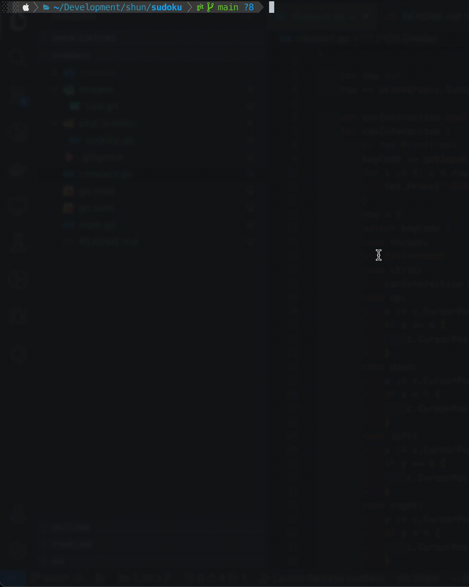

# Sudoku solving tool

The Sudoku solving tool.

## Binary Usage
```shell
go install github.com/nttu-ysc/sudoku@latest
```


## Docker 

Run following command building the tool
```shell
docker build -t sudoku .
```
And you can use
```shell
docker run --rm -it sudoku
```